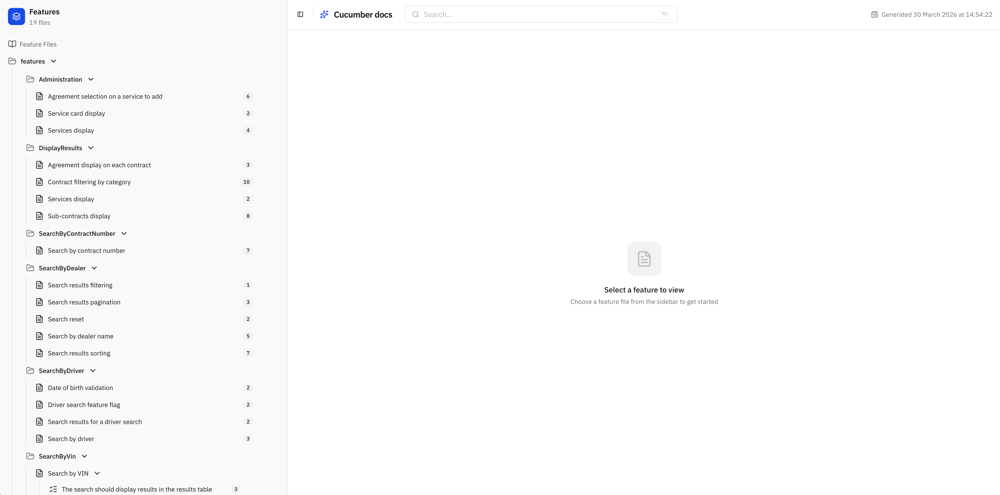
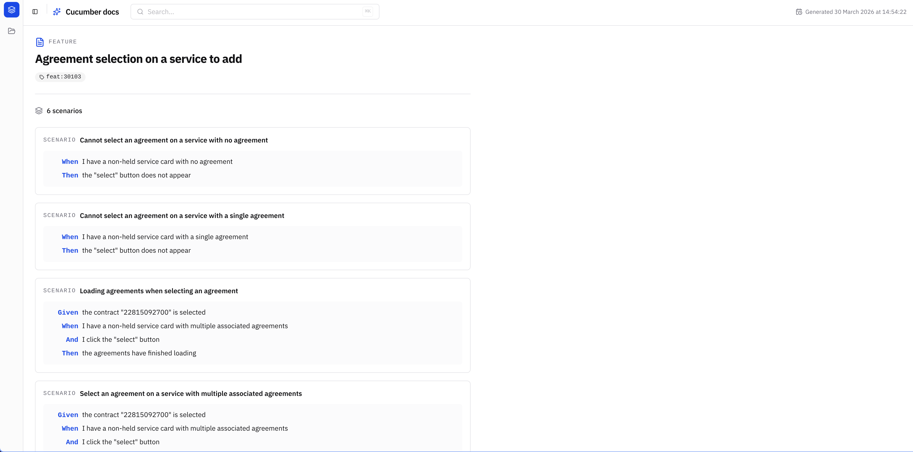
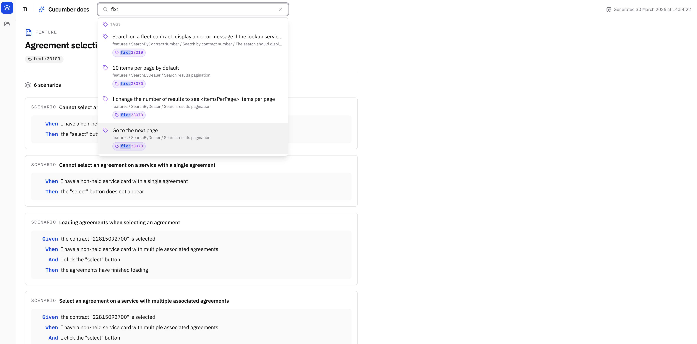
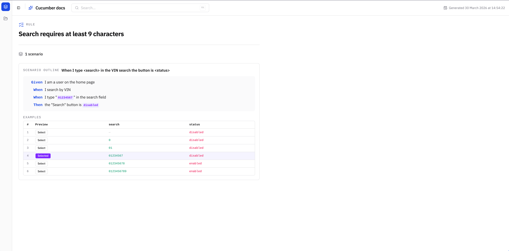

# piccali-cli

[](https://github.com/Odonno/piccali-cli/actions)
[](https://crates.io/crates/piccali-cli)
[](https://www.rust-lang.org/)
[](https://react.dev/)
[](https://tanstack.com/router)
[](https://biomejs.dev/)
[](https://cucumber.io/docs/gherkin/)
[](./LICENSE)

**piccali-cli** turns your Gherkin `.feature` files into living documentation — either as a static JSON/HTML artifact or as a locally-served interactive viewer you can open in any browser.

---

## Features

- **JSON output** — Export your full feature tree as structured JSON, ready to integrate with any pipeline or documentation system
- **HTML output** — Generate a self-contained static site (React SPA + data files) you can host anywhere, no server required
- **Interactive viewer** — Serve the documentation locally with a single command; your browser becomes a fully functional feature explorer
- **Folder-aware tree** — Mirrors your feature file hierarchy in the sidebar, with collapsible folders and scenario count badges
- **Feature pages** — Browse individual feature files with keyword, description, tags, background steps, rules, and scenarios
- **Scenario Outlines** — Preview variable substitution row-by-row directly in the UI; selected rows highlight their resolved step text live
- **Full-text search** — Search across feature names, scenario names, step text, and tags from the header bar; supports `@tag` prefix syntax
- **Tag hyperlinks** — Map tag prefixes to external URLs (e.g. Jira, Linear) so every tag becomes a clickable link to your issue tracker
- **Keyboard-first** — Trigger global search with `Ctrl+K` / `Cmd+K`, navigate results with arrow keys, and confirm with `Enter`

---

## Screenshots

<table>
  <tr>
    <td align="center">
      <br/>
      <sub>Interactive viewer — feature tree sidebar</sub>
    </td>
    <td align="center">
      <br/>
      <sub>Feature page with tags, steps, and background</sub>
    </td>
  </tr>
  <tr>
    <td align="center">
      <br/>
      <sub>Global search across features, scenarios, steps, and tags</sub>
    </td>
    <td align="center">
      <br/>
      <sub>Scenario Outline with live variable substitution</sub>
    </td>
  </tr>
</table>

---

## Getting Started

### Installation

**From npm (recommended):**

```bash
npx piccali-cli
```

**From crates.io:**

```bash
cargo install piccali-cli
```

**Build from source:**

```bash
git clone https://github.com/Odonno/piccali-cli
cd piccali-cli
cargo build --release
# binary is at ./target/release/piccali-cli
```

> **Prerequisites:** Rust (edition 2024), and [bun](https://bun.sh/) (required to build the frontend template).

---

### Serve the interactive viewer

Run from any directory containing `.feature` files:

```bash
piccali-cli
```

Opens the viewer at `http://localhost:3000`. Change the port with `-p`:

```bash
piccali-cli -p 8080
```

---

### Export to HTML (static site)

```bash
piccali-cli --formatter html --output ./docs/features
```

The output directory contains the full React SPA and two data files (`data.json`, `metadata.json`). Drop it on any static host (GitHub Pages, Netlify, S3, etc.).

---

### Export to JSON

```bash
# Write to a file
piccali-cli --formatter json --output features.json

# Print to stdout
piccali-cli --formatter json --dry-run
```

---

### Hyperlink tags to an issue tracker

Use `--tag-prefix` and `--tag-url-template` (repeatable) to turn tags like `@feat:ABC-123` into clickable links:

```bash
piccali-cli \
  --tag-prefix "feat:" \
  --tag-url-template "https://linear.app/my-team/issue/{id}"
```

The `{id}` placeholder is replaced by the part of the tag after the prefix.

---

### Custom glob for feature files

By default, piccali-cli discovers all `**/*.feature` files under the current directory. Override with `-i`:

```bash
piccali-cli -i "src/tests/**/*.feature" --formatter json --dry-run
```

---

## CLI Reference

```
Usage: piccali-cli [OPTIONS]

Options:
  -i, --input <GLOB>               Glob pattern for .feature files [default: **/*.feature]
  -f, --formatter <FORMATTER>      Output format: json | html | markdown
  -o, --output <PATH>              Output file or directory (conflicts with --dry-run)
      --dry-run                    Print output to stdout instead of writing a file
  -t, --title <TITLE>              Document title [default: "Cucumber docs"]
  -p, --port <PORT>                Port for the built-in web server [default: 3000]
      --tag-prefix <PREFIX>        Tag prefix to match (repeatable, pairs with --tag-url-template)
      --tag-url-template <URL>     URL template for tag links; use {id} as placeholder (repeatable)
  -h, --help                       Print help
  -V, --version                    Print version
```
